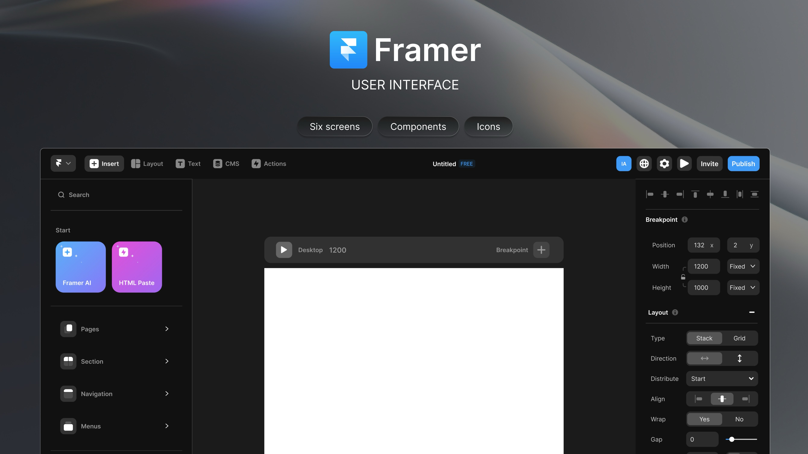
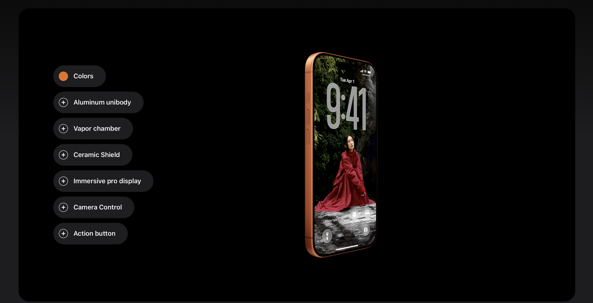

¨SUPSI 2026  
Corso d’interaction design, CV429.01  
Docenti: A. Gysin, G. Profeta  

Progetto 1: La conquista dello spazio

# Spacesuit evolution
Autore: Davide Barattini \
[Spacesuit evolution](https://github.com/ixd-supsi/2026/tree/main/esempi/es06_array_7)


## Introduzione e tema
Spacesuit evolution è un progetto che racconta l’evoluzione delle tute spaziali della NASA dagli anni ’60 fino al 2011, attraversando i principali programmi dell’esplorazione umana: Mercury, Gemini, Apollo e Space Shuttle.
In questo arco temporale, le tute spaziali si sono trasformate da semplici dispositivi di sopravvivenza a sistemi altamente complessi, progettati per operare in ambienti estremi e supportare attività sempre più articolate, come le passeggiate spaziali (EVA) e le operazioni sulla superficie lunare.
Il progetto utilizza immagini provenienti dagli archivi NASA per costruire un’esperienza interattiva che permette di osservare e comprendere come queste tute si siano evolute nel tempo, in relazione alle esigenze tecniche e agli obiettivi delle diverse missioni.
L’obiettivo è rendere accessibile un contenuto tecnico attraverso una modalità visiva pensata per un pubblico generalista.


## Riferimenti progettuali
[]()
[]()
[]()\
Per la progettazione dell'interfaccia sono stati presi come riferimento diversi prodotti digitali esistenti.
Apple ha ispirato il sistema di hotspot interattivi, utilizzati per evidenziare e approfondire specifici elementi delle tute spaziali direttamente all'interno della visualizzazione.
Figma e Framer hanno invece influenzato la struttura dell'interfaccia, basata su un layout a tre colonne che separa navigazione, contenuto principale e pannello di approfondimento, favorendo un'esplorazione chiara e organizzata delle informazioni.


## Design dell’interfaccia e modalità di interazione
L’interfaccia è costruita attorno alle immagini delle tute spaziali, che rappresentano l’elemento principale dell’esperienza.
Ogni tuta è presentata in modo isolato e accompagnata da punti interattivi (hotspot) posizionati sui diversi componenti.
Le principali modalità di interazione includono:
- Hover o click sui punti interattivi per visualizzare informazioni specifiche;
- Navigazione tra diverse tute appartenenti a epoche e missioni differenti;
- Organizzazione cronologica dei contenuti.

[]()


## Tecnologia usata
Il progetto è sviluppato come prototipo web utilizzando HTML, CSS e JavaScript, in cui i contenuti e la struttura dell’interfaccia sono generati a partire da dati definiti in codice.
Struttura dei dati
Le informazioni relative alle tute spaziali, alle sezioni e alla navigazione sono organizzate in strutture dati JavaScript, in particolare array di oggetti.
L’intero flusso dell’esperienza è definito all’interno dell’array slides, che rappresenta la sequenza delle schermate dell’applicazione. Ogni slide è identificata da un type (intro, section, suit) e contiene proprietà specifiche come titolo, testi, immagini e contenuti HTML.
- Le tute spaziali sono descritte tramite:
informazioni generali (nome, anni, introduzione)
risorse visive (immagini, modelli 3D)
hotspot interattivi
pannelli informativi strutturati in sezioni (caratteristiche, materiali, missioni, astronauti, componenti)
Questa struttura permette di gestire contenuti complessi in modo scalabile e facilmente aggiornabile.
- Gestione dell’interazione
Le interazioni utente sono gestite tramite JavaScript e includono:
navigazione tra le slide
apertura dei pannelli informativi
interazione con gli hotspot
aggiornamento dinamico dei contenuti
Il layout è realizzato tramite CSS (Grid e Flexbox).
I contenuti testuali e visivi sono stati raccolti da archivi pubblici della NASA e rielaborati per essere integrati nell’interfaccia.
Le informazioni sono organizzate in livelli:
- slide principali
- approfondimenti 
- dettagli tecnici
Questo sistema consente all’utente di passare progressivamente da una visione generale a un’esplorazione più dettagliata.

Definizione degli hotspot
```JavaScript
pins: [
  { n: 1, x: "52%", y: "22%", panelId: "casco" },
  { n: 2, x: "49%", y: "47%", panelId: "tubo_ossigeno" },
  { n: 3, x: "40%", y: "70%", panelId: "giunture" },
]
```
Creazione dei bottoni
```JavaScript
const btn = el("button", "pin", {
  style: `left:${p.x};top:${p.y};`,
  "data-panel-id": p.panelId,
}); "40%", y: "70%", panelId: "giunture" },
```

## Target e contesto d’uso
Il progetto è rivolto a:
- pubblico generalista
- appassionati di spazio
- utenti curiosi interessati alla tecnologia e alla storia
Il contesto principale è la navigazione web, in particolare su desktop, dove è possibile esplorare con maggiore precisione i dettagli delle tute e interagire con i punti informativi.
L’esperienza è pensata come esplorazione libera, associata ad una timeline.

[]()
